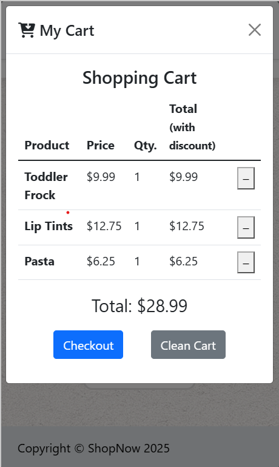

# 🛒 ShopNow – E-commerce

A responsive e-commerce web application built with **HTML, CSS and JavaScript**.

The project includes product browsing by category, shopping cart management, quantity handling, promotional discounts and a checkout form with validation.

<div align="center">
  
  
</div>

[](https://triflip.github.io/e-commerce/)

---

## 🚀 Features

- **Product catalog** — Browse products divided into Grocery, Beauty and Clothes categories.
- **Shopping cart** — Add products, increase or decrease quantities and remove items.
- **Promotions** — Automatically apply discounts when the required quantity is reached.
- **Dynamic totals** — Calculate cart totals according to quantities and applied discounts.
- **Checkout** — Complete a checkout form with client-side validation.
- **Responsive design** — Adapted to different screen sizes.
- **Mobile First** — Interface designed starting from smaller screens and progressively adapting to larger layouts.

## 🛠️ Technologies Used

- **HTML5** — Semantic page structure and accessible markup.
- **CSS3** — Custom styling and responsive layout.
- **JavaScript** — Application logic, DOM manipulation and cart management.
- **Bootstrap 5** — Responsive grid system, navigation, modal components and form styling.
- **Font Awesome** — Interface icons.

## 🧠 JavaScript Logic

The project focuses on implementing the main logic of an e-commerce application using JavaScript:

- Product selection and cart management.
- Quantity handling.
- Promotion calculation based on product conditions.
- Dynamic cart rendering.
- Total price calculation.
- Checkout form validation.
- DOM events and user interaction.

## 📱 Responsive & Mobile First

The interface is built following a **Mobile First** approach and uses Bootstrap's responsive utilities and grid system.

The navigation, product grid, shopping cart and checkout layout adapt to different screen sizes to provide a consistent experience on mobile, tablet and desktop devices.

## 📦 Local Installation

1. Clone the repository:

   ```bash
   git clone https://github.com/triflip/e-commerce.git
   cd e-commerce
   ```

2. Serve the project using a local development server.

   For example, with Python:

   ```bash
   python -m http.server
   ```

3. Open the local server URL shown in the terminal.

## 📁 Project Structure

```text
e-commerce/
├── assets/
│   ├── ecommerce-desktop.png
│   └── ecommerce-mobile.png
├── css/
│   └── styles.css
├── images/
├── js/
│   ├── checkout.js
│   ├── products.js
│   └── shop.js
├── checkout.html
├── index.html
└── README.md
```

## 🌐 Deployment

The application is deployed on **GitHub Pages**.

[](https://triflip.github.io/e-commerce/)

---

Built with HTML, CSS, JavaScript and Bootstrap.